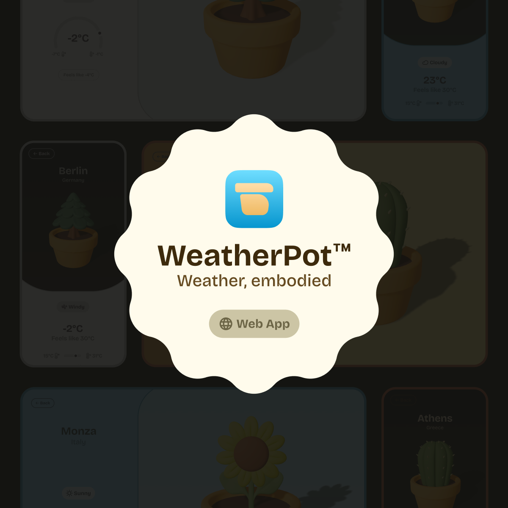

# Weather Pot

`Weather, embodied.`

What if your weather app didn’t just tell you the forecast, but showed it through a living, changing
plant? 🪴

Instead of just numbers and icons, a plant embodies real-world weather conditions in a playful way -
changing and adapting to the current temperature and condition.

> ### Try it out now!
>
> You can explore the project here: 🌱 https://weatherpot.app

## Design

All design and components are handmade by me in Figma. My goal has been to create a unique style
that combines modern user interfaces with a tactile, earthy feel and strong colors that embody the
feeling of weather.

## Tech Stack

I used this project as a playground and an opportunity to learn Svelte – the frontend framework
everyone seems to be in love with. And what can I say, have I fallen for it? Maybe a little. It’s
fast, reliable, and easy.

- Language: JS + Typescript
- Framework: Svelte + SvelteKit
- Styling: CSS + Sass
- DataBase: Neon (Postgres on Vercel)
